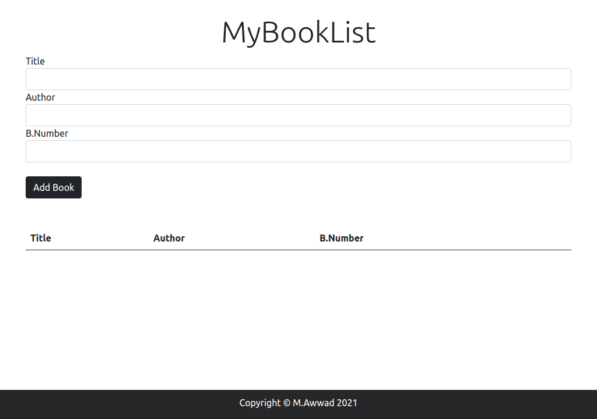
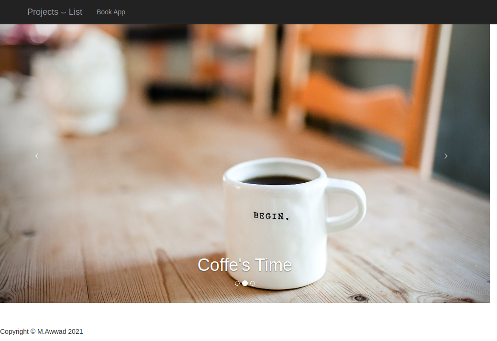
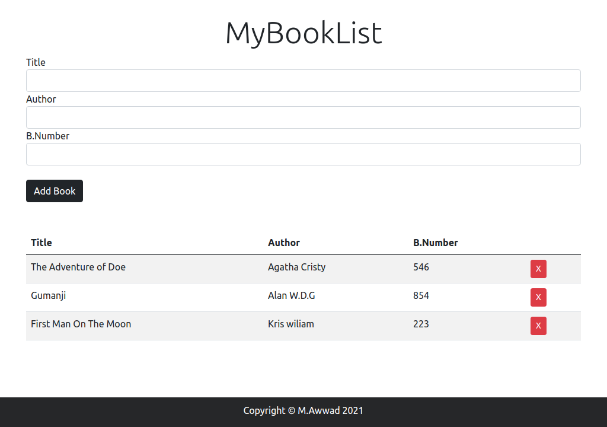

<!-- PROJECT LOGO -->
<p align="center">
  <a href="img/logo.png">
    
  </a>

  <h3 align="center">Book List App </h3>


  <!-- About The Project-->
## About The Project (Screens).

<a href="img/BookImg.png">
    
  </a>
  <a href="img/landingPage.png">
    
  </a>
  </a>
  <a href="img/bookadded.png">
    
  </a>
  

  
  _Feel Free To Clone Dude ;)_ 
==============================
Pull to your Local Repo 
-----------------------
```
git pull https://github.com/Mohamed24Awwad/bookapplist.git 

```


>Dependencies
```
1) Just A web Browser :)
```
  

